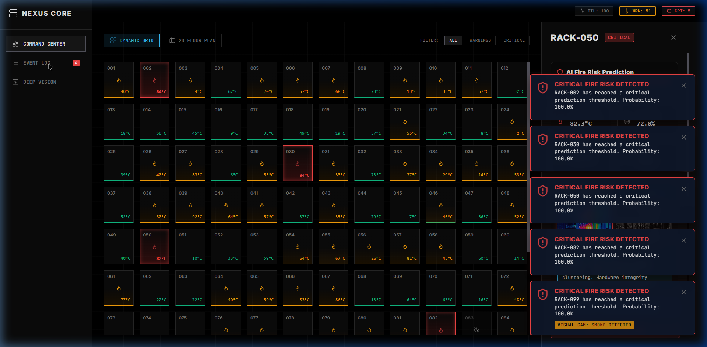
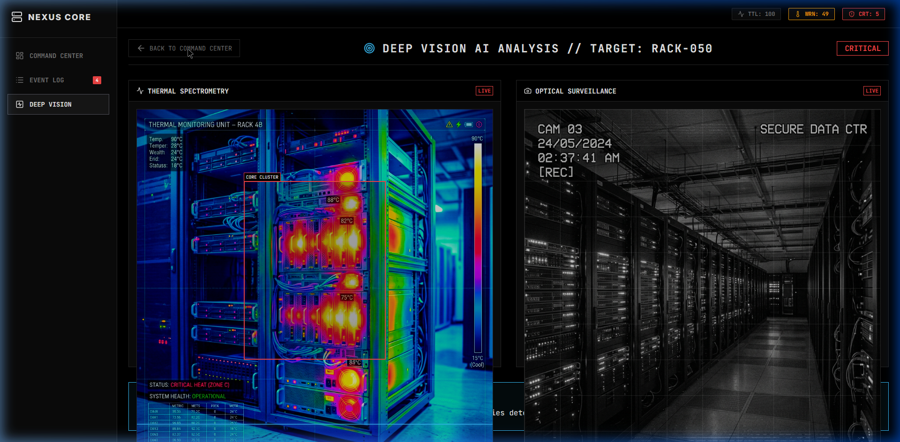

# Nexus Core AI // Thermal Prediction Dashboard

Nexus Core is a highly advanced, defense-inspired AI data center monitoring system. It provides real-time telemetry, predictive fire risk analysis, and deep vision surveillance capabilities across 100 simulated server racks.



## Core Capabilities

- **Military-Grade Austere UI**: A stark, precision-focused interface utilizing deep blacks, monospace typography, sharp 1px borders, and zero-bloom critical indicators.
- **Dynamic Command Center**: Monitor 100 server racks via a responsive dynamic grid or a 2D floor plan overlay. Instantly filter the grid by Warning or Critical states.
- **Deep Vision AI Console**: Access a dedicated full-screen console for any targeted rack. It ingests simulated thermal camera heat maps and optical CCTV security feeds, analyzing the gradients and synthesizing actionable AI conclusions (e.g., detecting localized heat gain or particulate smoke).
- **Global Event Ledger**: A persistent notification screen that chronologically logs every anomaly, thermal threshold breach, and manual override.
- **Simulation Engine**: A robust backend that streams continuous mock telemetry (temperature, GPU utilization, power draw) via WebSockets and calculates Fire Risk Probabilities.



## Architecture

- **Frontend**: React (Vite), TypeScript, Vanilla CSS (Austere Design System), Recharts for real-time telemetry graphing, Lucide-React for iconography.
- **Backend**: Node.js, Express, Socket.io (WebSockets) for real-time bi-directional streaming, TypeScript (tsx).

## Getting Started

### Prerequisites
- Node.js (v18+ recommended)
- npm

### Installation & Setup

1. **Install Dependencies**
   Open two terminal windows.
   
   *Terminal 1 (Backend):*
   ```bash
   cd backend
   npm install
   ```

   *Terminal 2 (Frontend):*
   ```bash
   cd frontend
   npm install
   ```

2. **Run the Application**
   
   *Terminal 1 (Start the Backend Simulation Engine):*
   ```bash
   npm start
   # Server runs on http://localhost:3001
   ```

   *Terminal 2 (Start the Frontend UI):*
   ```bash
   npm run dev
   # App runs on http://localhost:5173
   ```

3. Open your browser and navigate to `http://localhost:5173`.

## System Usage
- **View Toggles**: Switch between the standard 'Dynamic Grid' and spatial '2D Floor Plan' views using the toggles in the top-left of the Command Center.
- **Filtering**: Use the `ALL`, `WARNINGS`, and `CRITICAL` toggles in the top-right to instantly isolate problematic racks.
- **Telemetry Inspection**: Click on any rack node in the Command Center to open the side-panel telemetry viewer, displaying real-time line charts of GPU Load and Temperature.
- **Deep Vision Analysis**: From the side panel, click `DEEP ANALYZE` to transition into the full-screen optical and thermal AI analysis view.
- **Manual Overrides**: Use the `INITIATE PRECISION COOLING` or `EMERGENCY SHUTDOWN` buttons to manually intervene and mitigate thermal runaways.


### Email me on majipritam47@gmail.com For any enquiry

## Vision Assets
The frontend `public` directory contains the high-fidelity mock camera feeds (`thermal_cam.png` and `security_cam.png`) utilized by the Deep Vision module to simulate live AI analysis.
